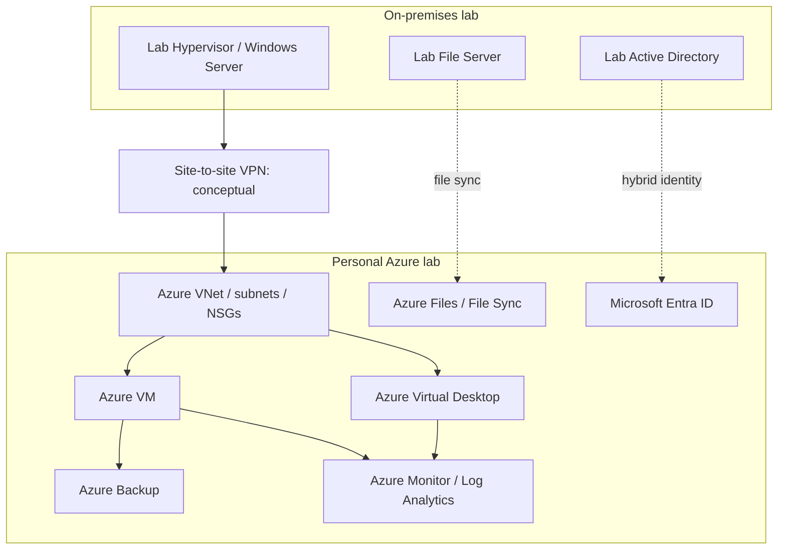

# Conceptual architecture (fictional)

```mermaid
flowchart TB
  subgraph OnPrem[On-premises lab]
    AD[Lab Active Directory]
    HV[Lab Hypervisor / Windows Server]
    FS[Lab File Server]
  end
  VPN[Site-to-site VPN: conceptual]
  subgraph Azure[Personal Azure lab]
    VNET[Azure VNet / subnets / NSGs]
    VM[Azure VM]
    AVD[Azure Virtual Desktop]
    FILES[Azure Files / File Sync]
    ID[Microsoft Entra ID]
    BAK[Azure Backup]
    MON[Azure Monitor / Log Analytics]
  end
  HV --> VPN --> VNET
  VNET --> VM
  VNET --> AVD
  FS -. file sync .-> FILES
  AD -. hybrid identity .-> ID
  VM --> BAK
  VM --> MON
  AVD --> MON
```

**Design only:** Arrows show intended service relationships, not deployed resources. Update after implementing your personal lab.
