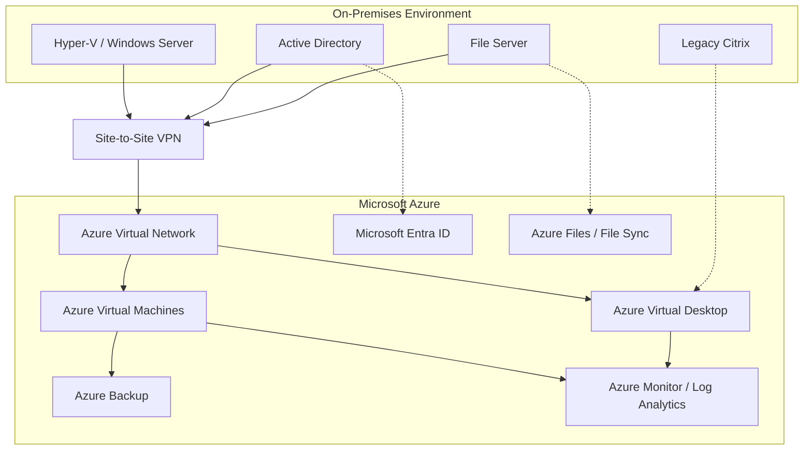

# Hybrid Azure Architecture

```mermaid
flowchart TB
    subgraph ONPREM["On-Premises Environment"]
        AD["Active Directory"]
        HV["Hyper-V / Windows Server"]
        FS["File Server"]
        CIT["Legacy Citrix"]
    end

    VPN["Site-to-Site VPN"]

    subgraph AZURE["Microsoft Azure"]
        VNET["Azure Virtual Network"]
        VM["Azure Virtual Machines"]
        AVD["Azure Virtual Desktop"]
        ENTRA["Microsoft Entra ID"]
        FILES["Azure Files / File Sync"]
        BACKUP["Azure Backup"]
        MON["Azure Monitor / Log Analytics"]
    end

    HV --> VPN
    AD --> VPN
    FS --> VPN
    VPN --> VNET
    VNET --> VM
    VNET --> AVD
    AD -.-> ENTRA
    FS -.-> FILES
    CIT -.-> AVD
    VM --> BACKUP
    VM --> MON
    AVD --> MON
```

**Note:** Illustrative architecture for a fictional personal lab. Not an employer infrastructure diagram.
  
